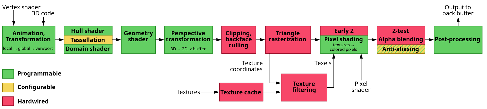

# The Graphics Pipeline
The graphics commands are processed in a pipeline fashion (meaning input into a stage is the output of the stage that proceeds it). 
The following image gives an overview of the graphics pipeline along with the different stages present in it. 

## Shaders
Shaders are programs that run on the GPU cores. Shaders are isolated meaning that they don't communicate with each other except via their inputs and outputs.

## Overview of the graphics pipeline 
The initial input to the pipeline is an array of data called **Vertex Data** (collection of vertices). Each vertex is a collection of data per 3D coordinate. Vertex data is represented using vertex attributes that can contain any type of data we want. Primitive type (i.e. render the vertex data as points, triangles or one line, etc.) must be specified to make sense of vertex data.

### Vertex shader
Vertex shader takes as input a single vertex. The main job of the vertex shader is to transform the local 3D coordinates to different 3D coordinates. Vertex shader is invoked once per vertex.

In OGL, only 3D coordinates in the range [-1.0:1.0] are processed (coordinates outside this range won't be visible). This region is called the normalized device coordinates. Hence, vertex output in the vertex shader must be in this range. These NDC coordinates will be transformed to screen-space coordinates via the viewport-transform using the data used to set up the viewport. The resulting screen-space coordinates are then transformed to fragments for the fragment shader.

### Geometry shader [Optional]
Takes vertex shader output and generate other shapes by emitting new vertices to form new (or other) primitive(s) (e.g. generates a second triangle out of the given shape).

### Primitive Assembly 
Takes as input all the vertices (or vertex if POINTS is specified) that form one or more primitives and assembles all the point(s) in the primitive shape specified.

### Pasteurization
The resulting primitives get mapped to their corresponding pixels on the final screen resulting in fragments (i.e. data required to render a single pixel)

### Clipping
Clipping discards all fragments that are outside the view.

### Fragment shader
Calculates the final color for each pixel. Most heavy calculations happen in this stage (to calculate lights, shadows, etc.). This shader is run for each pixel present in the screen.

### Alpha Testing and blending
Checks the corresponding depth and stencil value to check if the resulting fragment is in front or behind other objects and whether it should be discarded. It also checks for alpha values and blends objects accordingly.
Even if a pixel output color is calculated in the fragment shader, the final color could be a different color (due to fragments being discarded).
